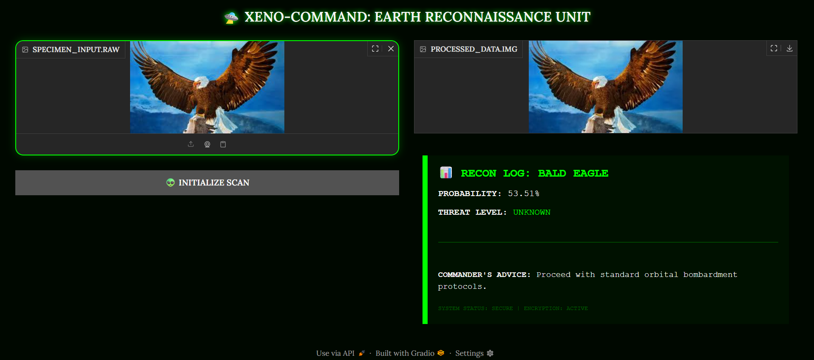

# 🛸 XENO-COMMAND: Earth Reconnaissance Unit

An immersive AI dashboard designed for an invading alien force to identify Earth species and assess strategic threats.

## 🧠 Technical Overview (ML Week 2)
This project applies core Machine Learning concepts to a real-world (and out-of-this-world) scenario:

* **Computer Vision (Topic 4):** Utilizes a pre-trained **EfficientNet-B0 Convolutional Neural Network (CNN)** to perform high-accuracy image classification.
* **Model Evaluation (Topic 5):** Implements **Softmax probabilities** to provide a "Confidence Score" for every scan.
* **Logic Systems:** A custom-built expert system translates Earth names into alien codenames and tactical advice.
* **UI/UX:** Built with **Gradio** and custom **CSS** for a polished, sci-fi aesthetic.

## 🛠️ How to Run
1. Open the `.ipynb` file in Google Colab.
2. Run all cells to launch the Gradio interface.
3. Upload a photo of an "Earth Specimen" (Parrot, Dog, Lab Coat) to receive a tactical report.

## 📁 Dataset
Powered by **ImageNet-1K**, providing a knowledge base of 1,000 unique Earth entities.

